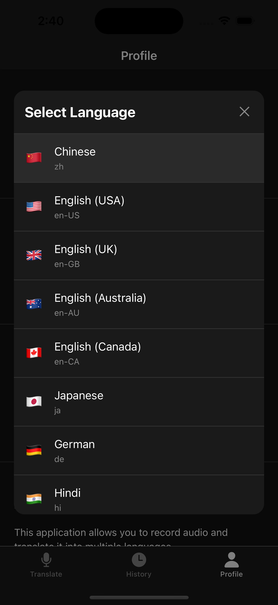
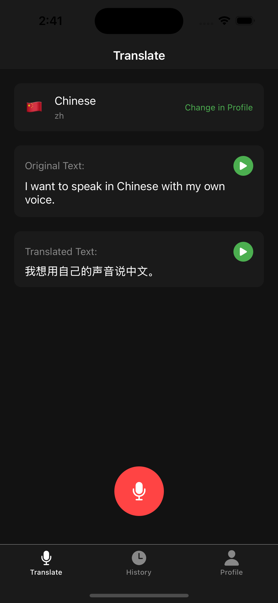
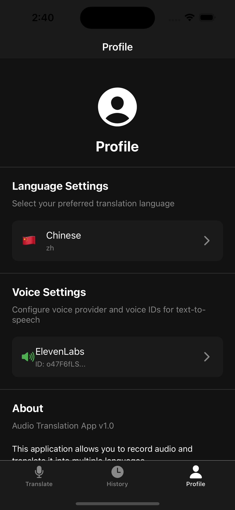
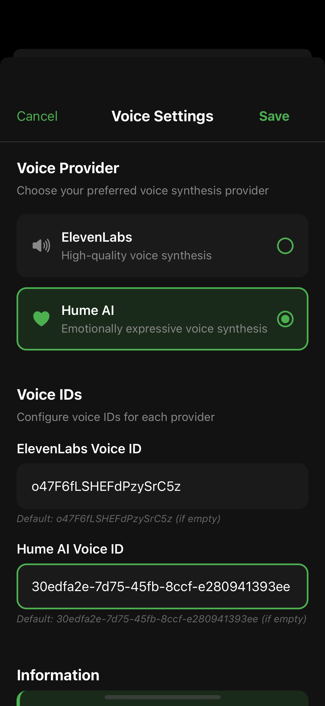
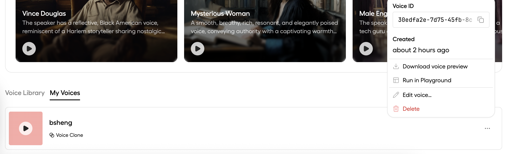
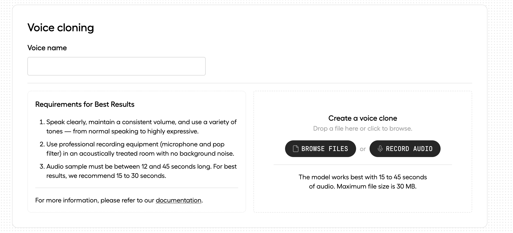

# EchoLingo


EchoLingo is a real-time voice translation application that allows you to speak in one language and have your speech translated and spoken back in another language.

## Demo

<p align="center">
  
  
  
</p>

### Voice Cloning Setup

Set up your custom voice for personalized translations:

<p align="center">
  
  
  
</p>

> **Note:** Video demos are available in the `demo/` folder (`demo.mov`, `demo_full1.MOV`) for a complete walkthrough of the app.

## 🚀 Quick Start

### Prerequisites

- Python 3.12+ (required for audioop module)
- Node.js 18+ and npm/pnpm
- uv (Python package manager)
- ngrok account and CLI tool (for public URL tunneling)
- Expo Go app on your mobile device

### Installation

1. **Clone the repository:**
   ```bash
   git clone <repository-url>
   cd Echo-Lingo
   ```

2. **Install uv (Python package manager):**
   ```bash
   # macOS/Linux
   curl -LsSf https://astral.sh/uv/install.sh | sh

   # Windows
   powershell -ExecutionPolicy ByPass -c "irm https://astral.sh/uv/install.ps1 | iex"
   ```

3. **Install and configure ngrok:**
   ```bash
   # macOS
   brew install ngrok

   # Linux
   snap install ngrok

   # Windows/Others - download from https://ngrok.com/download

   # Configure your ngrok auth token (sign up at https://ngrok.com)
   ngrok config add-authtoken YOUR_AUTH_TOKEN
   ```

4. **Set up environment variables:**
   Create a `.env` file in the project root:
   ```bash
   # Required API Keys
   OPENAI_API_KEY=your_openai_api_key_here
   ELEVENLABS_API_KEY=your_elevenlabs_api_key_here  # Optional: for voice synthesis
   HUME_API_KEY=your_hume_api_key_here              # Optional: for emotional voice synthesis

   # Optional: Custom ngrok configuration
   NGROK_DOMAIN=fond-workable-firefly.ngrok-free.app  # Or your custom domain
   BACKEND_PORT=50000
   ```

5. **Install project dependencies:**
   ```bash
   # Backend Python dependencies
   cd backend
   uv sync  # This will create venv and install all dependencies

   # Mobile React Native dependencies
   cd ../mobile
   npm install  # or pnpm install
   ```

## 🎯 Starting the Application

### Start Services Individually

#### Backend Server Setup
```bash
# Navigate to backend directory
cd backend

# Option A: Use the startup script (recommended)
./start.sh
# This automatically handles port conflicts and starts with ngrok

# Option B: Run directly with Python
uv run python run.py --mode prod
# Add --no-ngrok flag to run without tunnel (local development only)

# Option C: Development mode (hot reload, no ngrok)
uv run python run.py --mode dev --no-ngrok
```

The backend will:
- Start on http://localhost:50000
- Create ngrok tunnel at https://fond-workable-firefly.ngrok-free.app
- Provide API docs at https://fond-workable-firefly.ngrok-free.app/docs

#### Expo Frontend Setup
```bash
# Navigate to mobile directory
cd mobile

# Option A: Use the startup script
./start.sh

# Option B: Start Expo manually
npx expo start

# Option C: Start with cache cleared (if having issues)
npx expo start --clear

# Option D: Start with specific port
npx expo start --port 8081
```

The mobile app will:
- Start Expo dev server on port 8081
- Display QR code for Expo Go app
- Provide web interface at http://localhost:8081

## 📁 Project Structure

```
EchoLingo/
├── backend/              # FastAPI backend server
│   ├── src/             # Source code
│   │   ├── api/         # API routes and models
│   │   ├── core/        # Core configuration
│   │   ├── services/    # Business logic
│   │   │   └── voice_providers/  # ElevenLabs, Hume AI integrations
│   │   └── utils/       # Helper utilities
│   ├── run.py           # Main server entry point
│   ├── start.sh         # Backend startup script
│   ├── pyproject.toml   # Python dependencies (managed by uv)
│   └── .env             # Environment variables (create this)
├── mobile/              # React Native/Expo mobile app
│   ├── app/             # App screens and components
│   │   ├── (tabs)/      # Tab navigation screens
│   │   └── _layout.tsx  # Root layout
│   ├── start.sh         # Mobile startup script
│   ├── package.json     # Node dependencies
│   └── app.json         # Expo configuration
├── demo/                # Demo screenshots and videos
└── CLAUDE.md            # AI assistant instructions
```

## 🔧 Configuration

### Backend Configuration
- **Port:** 50000 (default)
- **Ngrok Domain:** fond-workable-firefly.ngrok-free.app
- **API Endpoint:** https://fond-workable-firefly.ngrok-free.app/api/audio/process

### Mobile Configuration
- **API URL:** Configured in `mobile/app/(tabs)/index.tsx`
- **Expo Port:** 8081 (default)

## 📝 API Documentation

Once the backend is running, visit:
- **Swagger UI:** https://fond-workable-firefly.ngrok-free.app/docs
- **ReDoc:** https://fond-workable-firefly.ngrok-free.app/redoc

### Voice Provider Support

The API supports multiple voice providers for text-to-speech generation:

**Supported Providers:**
- **ElevenLabs** (default): High-quality voice synthesis
- **Hume AI**: Emotionally expressive voice synthesis

**API Parameters:**
- `voice_provider`: Specify "elevenlabs" or "hume" (defaults to "elevenlabs")
- `voice_id`: Specify any valid voice ID for the chosen provider (uses provider's default if omitted)

**Example API Calls:**
```bash
# Use default ElevenLabs provider with default voice
curl -X POST "https://fond-workable-firefly.ngrok-free.app/api/audio/process" \
  -F "file=@audio.wav"

# Use ElevenLabs with specific voice ID
curl -X POST "https://fond-workable-firefly.ngrok-free.app/api/audio/process?voice_provider=elevenlabs&voice_id=voice_123" \
  -F "file=@audio.wav"

# Use Hume AI with specific voice ID
curl -X POST "https://fond-workable-firefly.ngrok-free.app/api/audio/process?voice_provider=hume&voice_id=hume_voice_456" \
  -F "file=@audio.wav"
```

## 🛠️ Development

### Backend Development
```bash
cd backend

# Development server with hot reload
uv run python run.py --mode dev --no-ngrok

# Run with custom port
uv run python run.py --port 8000 --no-ngrok

# Run tests
uv run pytest

# Linting and formatting
uv run ruff check .
uv run ruff format .
```

### Mobile Development
```bash
cd mobile

# Start development server
npx expo start --clear

# Run on specific platform
npx expo start --ios       # iOS simulator
npx expo start --android    # Android emulator
npx expo start --web        # Web browser

# Build for production
npx expo build:ios
npx expo build:android

# Run linting
npm run lint
```

### Verifying Setup

1. **Backend Health Check:**
   ```bash
   # Check if backend is running
   curl http://localhost:50000/health

   # Check ngrok tunnel
   curl https://fond-workable-firefly.ngrok-free.app/health
   ```

2. **API Documentation:**
   - Swagger UI: https://fond-workable-firefly.ngrok-free.app/docs
   - ReDoc: https://fond-workable-firefly.ngrok-free.app/redoc

3. **Mobile App Connection:**
   - Ensure the API URL in `mobile/app/(tabs)/index.tsx` matches your ngrok URL
   - Check console logs in Expo for connection errors

## 🐛 Troubleshooting

### Backend Issues
- **audioop error:** Ensure Python 3.12+ is installed (audioop is built-in)
  ```bash
  python --version  # Should be 3.12 or higher
  ```
- **Port already in use:** The startup scripts automatically handle this
  ```bash
  # Manual fix if needed
  lsof -i :50000  # Find process using port
  kill -9 <PID>   # Kill the process
  ```
- **ngrok authentication error:**
  ```bash
  ngrok config add-authtoken YOUR_AUTH_TOKEN
  ```
- **Module not found errors:**
  ```bash
  cd backend
  uv sync  # Reinstall dependencies
  ```

### Mobile Issues
- **Expo Go connection failed:**
  - Ensure your phone and computer are on the same network
  - Check firewall settings
  - Try using tunnel mode: `npx expo start --tunnel`

- **Metro bundler issues:**
  ```bash
  # Clear all caches
  npx expo start --clear
  rm -rf node_modules/.cache
  npm install
  ```

- **API connection errors:**
  - Verify backend is running: `curl http://localhost:50000/health`
  - Check ngrok URL in mobile app matches backend
  - Ensure `.env` file has correct API keys

### Environment Issues
- **Missing API keys:** Check `.env` file has all required keys
- **Permission errors:** Ensure scripts are executable
  ```bash
  chmod +x backend/start.sh
  chmod +x mobile/start.sh
  ```

## 📦 Dependencies

### Backend (Python 3.12+)
- FastAPI
- uvicorn
- OpenAI API
- ElevenLabs
- Hume AI
- pydub

### Mobile (React Native/Expo)
- Expo SDK 54
- React Native
- expo-av (audio recording/playback)
- axios (HTTP client)
- expo-file-system

## 🔑 Environment Variables

Create a `.env` file in the project root with your API keys:

```bash
# Required - OpenAI for translation
OPENAI_API_KEY=sk-...your_key_here

# Optional - Voice synthesis providers (at least one recommended)
ELEVENLABS_API_KEY=...your_key_here  # High-quality voices
HUME_API_KEY=...your_key_here        # Emotional voice synthesis

# Optional - Custom configuration
NGROK_DOMAIN=your-custom-domain.ngrok-free.app  # Custom ngrok domain
BACKEND_PORT=50000                              # Backend server port
```

### Getting API Keys:
1. **OpenAI:** Sign up at https://platform.openai.com
2. **ElevenLabs:** Sign up at https://elevenlabs.io
3. **Hume AI:** Sign up at https://www.hume.ai
4. **ngrok:** Sign up at https://ngrok.com for auth token

## 📱 Usage

1. Start the backend server: `cd backend && ./start.sh`
2. Start the mobile app: `cd mobile && ./start.sh`
3. Open the Expo Go app on your phone
4. Scan the QR code displayed in the terminal
5. Select your target language
6. Press and hold the microphone button to record
7. Release to send for translation
8. The translated audio will play automatically

## 🤝 Contributing

Feel free to submit issues and enhancement requests!

## 📄 License

This project is licensed under the MIT License.